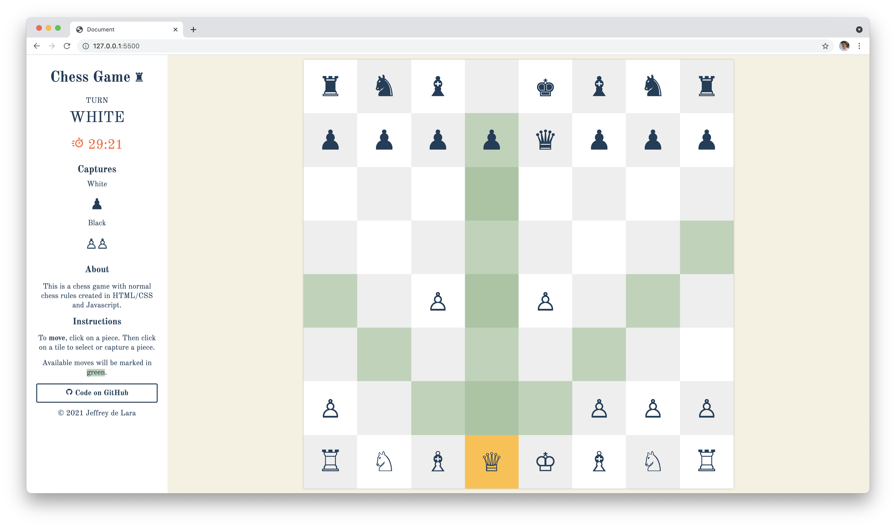

# Chess Game

A complete turn-based chess game created in HTML/CSS and vanilla Javascript. The game allows you to know available moves for your pieces. Helps you get out of checks by suggesting moves for King. It also automatically detects a `checkmate` when a couple of conditions are met. 

*An example of a Queen making her move.*

## Current features:
- Turn-based - White plays first.
- Movement and attack - units can move and capture other units.
- Move suggestion - once you click on a piece, it will show available moves for the unit. This can be a great way for beginners to learn how to play chess. It also has suggestions for `King` to move in a safe place and avoid a `check`.
- Check / Checkmates
- Timer for each player and countdown
- Game automatically ends after the detection of a `Checkmate`

## Detecting a way to survive
When a `King` is checked, the game will look for possible ways to get out of a check and will suggest you some moves. For example, if a `King` can not move, it will look for its other pieces if its possible to block or capture a `checker`. Though, the suggestions can only be seen on the dev console.

## Movement and Attacks 
- Pawn
- Rook
- Bishop
- Knight
- Queen 
- King
- Castling
- En passant

## Todo:
Here is a list of items that is still needed to be done.

- Pawn promotion
